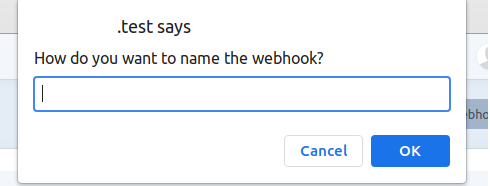
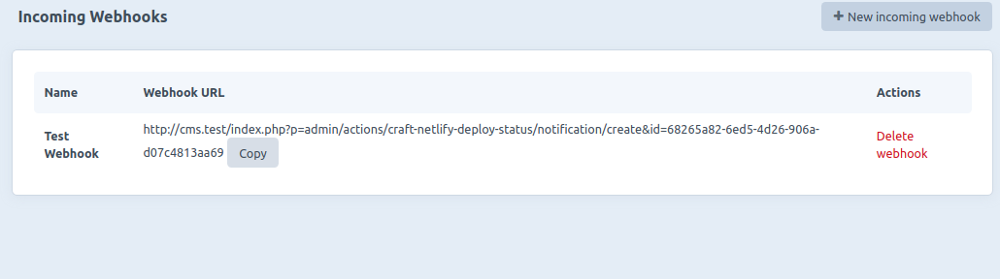
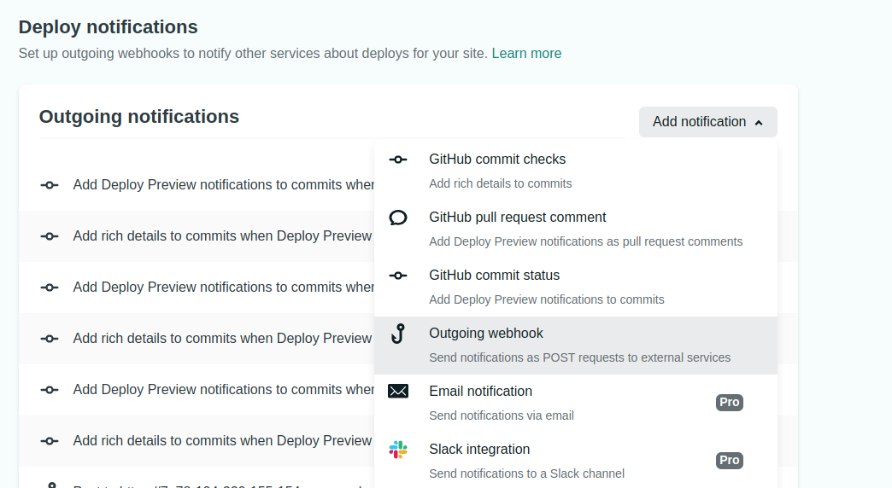
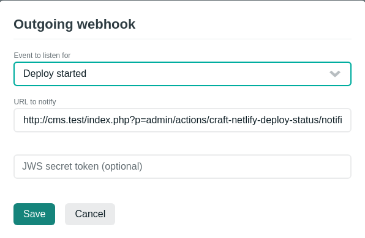
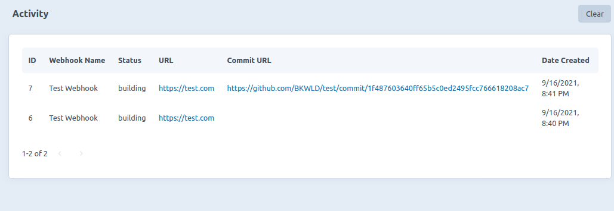

# Craft Netlify Deploy Status plugin for Craft CMS 3.x

Craft plugin that shows Netlify deploy statuses

## Requirements

This plugin requires Craft CMS 3.0.0-beta.23 or later.

## Installation

To install the plugin, follow these instructions.

1. Open your terminal and go to your Craft project:

        cd /path/to/project

2. Then tell Composer to load the plugin:

        composer require bukwild/craft-netlify-deploy-status

3. In the Control Panel, go to Settings → Plugins and click the “Install” button for Craft Netlify Deploy Status.

## Adding Webhooks

1. Create a new incoming webhook in /admin/craft-netlify-deploy-status
        

2. Copy Webhook Url
        

3. In Netlify, go to Site Settings ->  Build & Deploy -> Deploy Notifications, click on Add notification and select Outgoing Webhook
        

4. Paste the Webhook URL in the URL to notify field and select an event to listen for and click Save. *NOTE*: use the same Webhook URL for all the events in a single project you want to get notifications from. One Webhook URL per Netlify project.
        

5. To test the webhook, try deploying a site or making a commit to the site. (If redeploying the site there will be no Commit URL)
        

* Release it

Brought to you by [Bukwild](https://bukwild.com)
